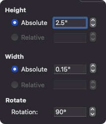

# archery-sight-tape
 Tool to create an SVG for printing an archery sight tape.


# Prepare the sight-settings.csv

From archers advantage, printing the "sight settings" and copying the values, I replaced the values into a more standardized list using `(\d+):\s(\d\.\d{3})\s` and replacing with `\1,\2\n` using sublime text.


## Run the script.

```bash
python3.9 ./archery-sight-tape.py --help
usage: archery-sight-tape.py [-h] [--height HEIGHT] [--width WIDTH] [--start START] [--output OUTPUT] [--input INPUT] [--ppi PPI] [--large-color LARGE_COLOR] [--medium-color MEDIUM_COLOR]
                             [--small-color SMALL_COLOR]

optional arguments:
  -h, --help            show this help message and exit
  --height HEIGHT       Height of the sight to output. Default 2.5" (black gold sight)
  --width WIDTH         Width of the sight to output. Default .375" (black gold sight)
  --start START         Position "0" the top value, .269 (in) default. Typically the value at 40y.
  --output OUTPUT       Output .svg filename. default 'sight-tape.svg'
  --input INPUT         Input csv for the sight settings. Default 'sight-settings.csv'.
  --ppi PPI             Pixels per inch. Default 300
  --large-color LARGE_COLOR
                        Value for the 10 (y/m) line color. Default 'red'.
  --medium-color MEDIUM_COLOR
                        Value for the 5 (y/m) line color. Default 'green'.
  --small-color SMALL_COLOR
                        Value for the 1 (y/m) line color. Default 'black'.
```

## Example Output


## How to print.

Using microsoft word, drag and drop the svg onto the document. Update the absolute height to be the same as the input settings.




The main benefit of this is to be able to print on address labels instead of using a whole sheet, or gluing the sight tapes on.

