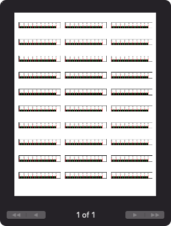

# Archery Sight Tape

## Overview

This is a tool to help make nicer sight tapes. 

The main benefit of this is to be able to print on address labels instead of using a whole sheet, or gluing the sight tapes on.

It can be accessed from https://sight-tape.alphabet5.dev

## Sighting in your bow

[Archers Advantage](https://www.archersadvantageonline.com/index.php?option=com_content&view=article&id=50&Itemid=17) has an excellent write-up on how to sight in your bow using the calculate speed method. (dialing to two distances, and mesasuring the pin gap/sight movement between the two.)

## Generating your sight marks


Copy and paste the values (starting at 0.000) into the form at https://sight-tape.aphabet5.dev/


## Measuring your sight

The two critical measurements for your sight tape are the height and width you want your sight tape. (A and B)

All other measurements are for appearances. 


## How to print.

Using microsoft word, drag and drop the svg onto the document. Update the absolute height to be the same as the input settings.




## Advanced Settings Overview

- A: Height of the sight tape
- B: Width of the sight tape
- C: Start Height
- F,E,D: Line Width
- G: Font Y Offset
- H: Font X Offset


## Building and Running

To create the docker image

```bash
docker buildx create --use
docker buildx build --platform linux/amd64,linux/arm64 --push -t alphabet5/archery-sight-tape .
```

To run locally

```bash
docker run --rm -p 8090:8090 alphabet5/archery-sight-tape
```
